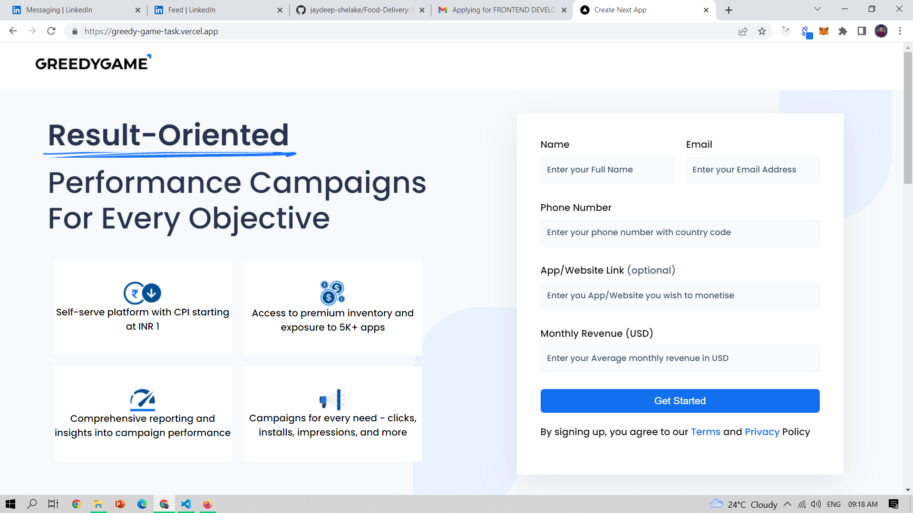
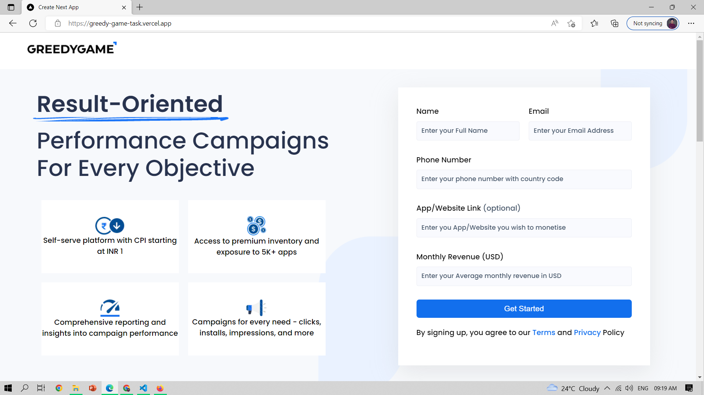
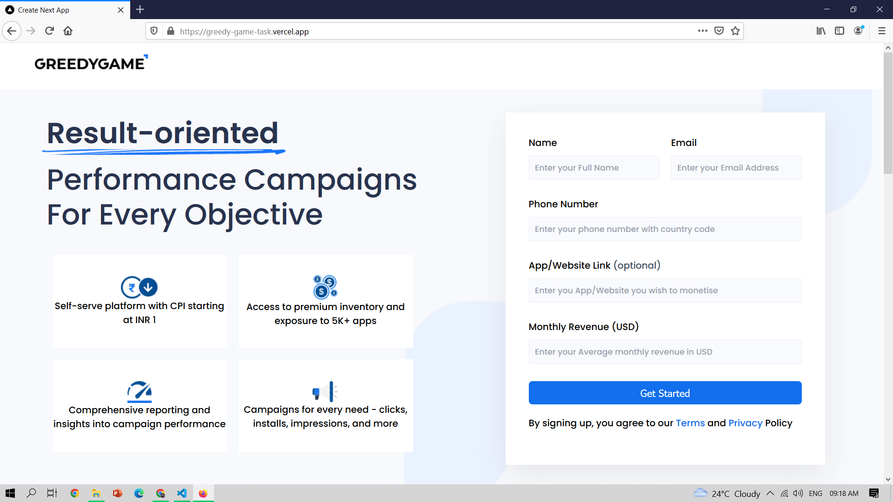
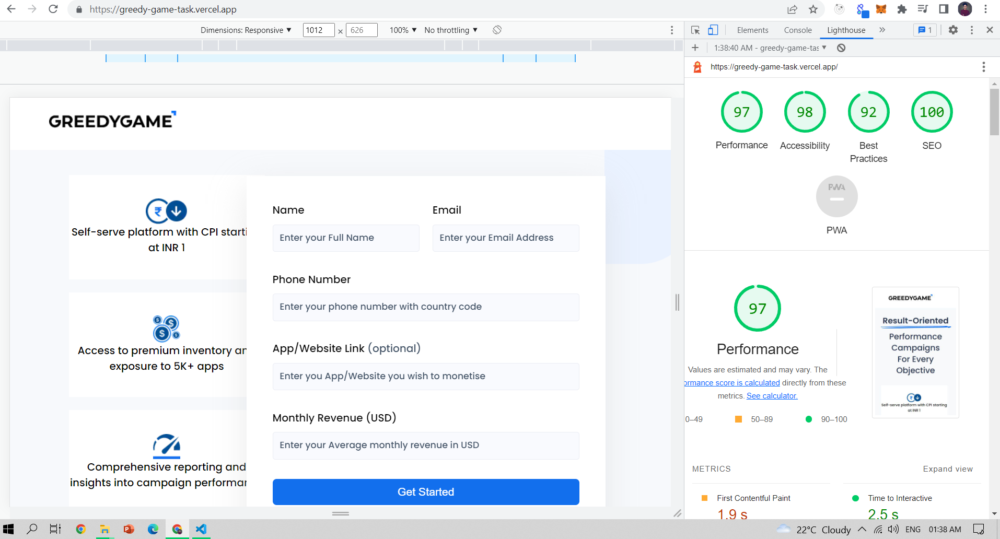

# Greedy Game

  

 

## ⚙️ Detailed Features

- Navbar and form are stiky at deskstop view
- Page is responsive for mobile and Tablets
- Page support all browsers (chrome,firefox and microsoft edge)
- Page speed is optimized upto 97%
- From validation is done for all fields using vanilla React no third party libraries
- Followed best practices for NextJS application

## 🚀 Tech and Tools Used

- Next.JS and CSS
- VS code , Vercel

## Decisions and Assumptions

- Even the UI was of single page ,I made decisions to go
  with component based designed which helped me structure the code properly and made the components reusable
- For styling I did't used any css framework instead of the I gone with custom css (module css)
- Followed proper semantic HTML

## 📸 Screenshots

## Home Page (Chrome)

 

## Home Page (Edge)

 

## Home Page (Firefox)

 

## Lighthouse

 

### LINK :

https://greedy-game-task.vercel.app/
